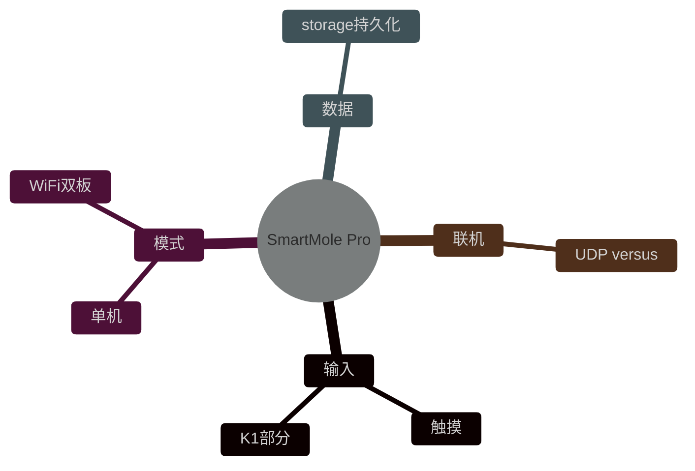

<div class="cover-bg" style="background-image:url(/images/hammer_arcade.jpg)"></div>

<div class="cover-content">

# SmartMole Pro

<div class="hero-tag mt-4">综合完成度约 60% · ✓ / ⚠ / × 如实标注</div>

## 多模态感知智能打地鼠竞技系统

<p class="text-lg opacity-80 mt-6">OpenVela (NuttX RTOS) · 课程设计结题答辩</p>

<p class="mt-8 opacity-70">第六组 · 张恒基 · 曹佳轩 · 缪钰 · 郭志罡 · 张耀辉 · 朱辰骏</p>

</div>

<!--
封面：北邮蓝金深色主题，街机背景纹理
-->

---
layout: two-cols
transition: fade-out
---

# 项目背景与动机

<div class="text-left text-base mt-4 space-y-3">

**起** — WhackMole 基础实验 + OpenVela/NuttX 可运行

**痛** — 单一触控、无联机、无声光与持久化

**机** — T113S3 板载 Wi-Fi / 音频 / GPIO

**愿** — 闯关 + 双板联机可答辩系统

</div>

::right::

<div class="img-frame mt-4">


</div>

---
layout: two-cols
---

# 五层目标体系

<div class="text-left text-sm mt-2">

| 层级 | 目标 | 状态 |
|------|------|------|
| L1 | 基础 WhackMole | <span class="badge badge-ok">✓ 100%</span> |
| L2 | 多模态输入 | <span class="badge badge-warn">⚠ 30%</span> |
| L3 | 闯关 + 联机 | <span class="badge badge-ok">✓ 70%</span> |
| L4 | 声光 / 存储 | <span class="badge badge-warn">⚠ 50%</span> |
| L5 | UI + WiFi 菜单 | <span class="badge badge-warn">⚠ 40%</span> |

</div>

::right::

<div class="img-frame">


</div>

---
layout: default
---

# 已实现技术亮点

<div class="grid-3 mt-6 text-sm text-left">

<div class="card card-ok"><carbon-chart-line class="inline text-green-400"/> **五级闯关**<br/>LEVEL 1–5 参数表</div>
<div class="card card-ok"><carbon-wifi class="inline text-blue-400"/> **Wi-Fi 联机**<br/>UDP versus 协议</div>
<div class="card card-ok"><carbon-star class="inline text-yellow-400"/> **特殊地鼠**<br/>黄金 / 炸弹 / COMBO</div>
<div class="card card-ok"><carbon-application class="inline"/> **游戏 UI**<br/>9 洞 + 5 按钮</div>
<div class="card card-ok"><carbon-settings class="inline"/> **WiFi 菜单**<br/>wifi_ui.c 图形配置</div>
<div class="card card-warn"><carbon-volume-up class="inline text-orange-400"/> **声光反馈**<br/>GPIO 降级方案</div>

</div>

<div class="grid-2 mt-6 items-center">

<div class="img-frame"></div>

<div class="text-center">
  <div class="text-6xl font-bold" style="color:#d4a84b">60%</div>
  <div class="opacity-70">结题综合完成度</div>
</div>

</div>

---
layout: two-cols
---

# 三层架构

<div class="text-left text-sm mt-4 space-y-2">

<v-clicks>

- **用户交互层** — 触摸 + K1 + LVGL
- **应用逻辑层** — 状态机 + storage + versus
- **驱动 / 系统层** — NuttX · GPIO · wapi
- <span class="opacity-60">开题扩展 HC-SR04 / WS2812B / littlefs 未全量落地</span>

</v-clicks>

</div>

::right::

<div class="img-frame">


</div>

---
layout: two-cols
---

# 多线程并发模型

<div class="text-left text-sm">

<v-clicks>

- <carbon-laptop/> **LVGL 主线程** — UI + 游戏逻辑 + 定时器
- <carbon-audio-console/> **sound_task** — hit.wav 轮询播放
- <carbon-light/> **led_task** — GPIO 120ms 闪烁
- <carbon-keyboard/> **key_task** — K1 → START
- <carbon-network-4/> **versus_rx_task** — UDP 非阻塞收包

设计原则：**请求-消费标志位**，避免阻塞 GUI

</v-clicks>

</div>

::right::

<div class="img-frame">


</div>

---
layout: two-cols
---

# 输入与事件流

<div class="img-frame">


</div>

::right::

<div class="text-left text-sm mt-8">

<v-clicks>

- <span class="badge badge-ok">✓</span> 触摸 → `mole_click_event`
- <span class="badge badge-ok">✓</span> K1 → `start_game_request`
- <span class="badge badge-no">×</span> 统一 `hit_event_t` 队列
- <span class="badge badge-no">×</span> HC-SR04 距离映射
- versus 报文与板内事件 **分离互不干扰**

</v-clicks>

</div>

---
layout: two-cols
---

# 五级闯关系统 <span class="badge badge-ok">✓</span>

<div class="text-left text-sm mt-2">

- LEVEL 1–5 独立 `refresh_ms / show_ms / mole_count`
- LEVEL 按钮循环选关
- 黄金 15% / 炸弹 5%
- `level_configs[]` L52–58

</div>

::right::

<div class="img-frame">


</div>

---
layout: two-cols
---

# 多模态输入 <span class="badge badge-warn">⚠</span>

<div class="img-frame mt-2">


</div>

::right::

<div class="text-left text-sm mt-6">

<v-clicks>

- <span class="badge badge-ok">✓</span> 触摸屏 9 洞 + 锤子光标
- <span class="badge badge-warn">⚠</span> K1 `key_task` 触发 START
- <span class="badge badge-no">×</span> K2 半区映射
- <span class="badge badge-no">×</span> HC-SR04 / 事件队列

</v-clicks>

<div class="img-frame mt-6">


</div>

</div>

---
layout: two-cols
---

# Wi-Fi 双板联机 <span class="badge badge-ok">✓</span>

<div class="text-left text-sm">

<v-clicks>

- versus 模块（张耀辉）
- **R528** UDP Wi-Fi 框架 · OpenVela 双人联机
- **START / SCORE / FINISH** 实时双板同步
- **`finish_from_peer`** 防 FINISH 环路 · 状态收敛
- A/B 固定 IP/端口 · 多轮实机联调 ✓
- `versus_rx` 10ms · UI 50ms 刷新
- 双板各自全屏，不做 LVGL 分屏

</v-clicks>

```cpp
// versus 24B 报文 · CRC · 序号去重
// peer_ip = "192.168.137.91";  // L1103
// local_port = 43046;
```

</div>

::right::

<div class="img-frame">


</div>

---
layout: two-cols
---

# 联机 IP 锁定

<div class="img-frame">


</div>

::right::

<div class="text-left text-sm mt-4">

<v-clicks>

1. 现状：`peer_ip` 硬编码 L1103
2. 端口 43046 / 43045
3. 换板：改宏 → 编译 → 烧录
4. 后续：`versus.conf` / WiFi 弹窗

</v-clicks>

<div class="card card-primary mt-6">

<carbon-wifi class="inline"/> 联调期优先 **双板稳定**，配置化待补

</div>

</div>

---
layout: two-cols
---

# 声光反馈 <span class="badge badge-warn">⚠</span>

<div class="img-frame">


</div>

::right::

<div class="text-left text-sm">

- 8 wav 资源，仅 **hit.wav** 已挂钩
- `aplay -D hw:audiocodec`
- GPIO LED 击中闪 **120ms**
- WS2812B SPI 时序未调通 → **GPIO 降级**

<div class="grid-2 mt-4">

<div class="img-frame"></div>
<div class="img-frame"></div>

</div>

</div>

---
layout: two-cols
---

# 数据存储 <span class="badge badge-warn">⚠</span>

<div class="text-left text-sm">

- `/data/whackmole_stats.dat` 持久化
- 最高 / 连击 / 局数 / 联机统计
- STATS 弹窗只读展示
- 未做 littlefs 排行榜 Tab

</div>

::right::

<div class="img-frame">


</div>

---
layout: two-cols
---

# WiFi 图形连接 <span class="badge badge-ok">✓</span>

<div class="img-frame">


</div>

::right::

<div class="text-left text-sm mt-4">

<v-clicks>

- `wifi_ui.c` LVGL 弹窗
- SCAN → `/data/wifi_scan.txt`
- CONNECT → wapi + renew
- 演示镜像：**地鼠_WIFI图形联网版.img**

</v-clicks>

<div class="img-frame mt-4">


</div>

</div>

---
layout: two-cols
---

# 特殊地鼠 + COMBO <span class="badge badge-ok">✓</span>

<div class="img-frame">


</div>

::right::

<div class="text-left text-sm mt-6">

| 类型 | 效果 |
|------|------|
| 黄金地鼠 | +5 分 |
| 炸弹地鼠 | -2 分，清零 COMBO |
| COMBO ×3 | +1 奖励 |
| COMBO ×10 | +5 奖励 |

源码：`mole_click_event` L998–1048

</div>

---
layout: two-cols
class: text-sm
---

# 硬件与降级矩阵

<table class="mt-2">
<thead><tr><th>模块</th><th>选型</th><th>状态</th><th>降级</th></tr></thead>
<tbody>
<tr><td>超声波</td><td>HC-SR04</td><td><span class="badge badge-no">×</span></td><td>触摸+K1</td></tr>
<tr><td>灯效</td><td>WS2812B</td><td><span class="badge badge-no">×</span></td><td>GPIO LED</td></tr>
<tr><td>按键</td><td>K1/K2</td><td><span class="badge badge-warn">⚠</span></td><td>触摸为主</td></tr>
<tr><td>Wi-Fi</td><td>板载 STA</td><td><span class="badge badge-ok">✓</span></td><td>wifi_ui</td></tr>
<tr><td>存储</td><td>文件</td><td><span class="badge badge-warn">⚠</span></td><td>STATS</td></tr>
<tr><td>开发板</td><td>T113S3</td><td><span class="badge badge-ok">✓</span></td><td>—</td></tr>
</tbody>
</table>

::right::

<div class="img-frame mt-2">


</div>

---
layout: two-cols
class: text-sm
---

# 人员分工（与开题报告 §7.1 一致）

<table>
<thead><tr><th>成员</th><th>负责模块</th><th>备注</th></tr></thead>
<tbody>
<tr><td>张恒基</td><td>系统总架构 + 全局集成</td><td>项目负责人</td></tr>
<tr><td>曹佳轩</td><td>多模态输入 + 驱动</td><td>外设实现，辅助前端</td></tr>
<tr><td>缪钰</td><td>声光 + GUI 重构 + UI</td><td>UI 核心</td></tr>
<tr><td>郭志罡</td><td>关卡体系 + AI + 特殊地鼠</td><td>核心框架，主要编码</td></tr>
<tr><td>张耀辉</td><td>Wi-Fi 联机 + versus</td><td>versus 核心实现</td></tr>
<tr><td>朱辰骏</td><td>存储 + 排行榜 + 成就</td><td>联机联调 + storage API</td></tr>
</tbody>
</table>

::right::

<div class="img-frame">


</div>

---
layout: two-cols
---

# 协作机制

<div class="img-frame">


</div>

::right::

<div class="text-left text-sm mt-6">

<v-clicks>

- versus 核心冻结，仅配置层可改
- `storage.h` / `wifi_ui.h` API 接入
- Git feature → review → 合并
- 文档四件套 `docs/*.typ`

</v-clicks>

</div>

---
layout: default
---

# 四周里程碑

<div class="img-frame mt-4 max-h-80 mx-auto">


</div>

<p class="text-sm opacity-70 mt-4">待补：IP 外置 · 8 音效挂钩 · 超声波 · 排行榜 Tab</p>

---
layout: default
---

# 完成度对照（12 项）

<div class="img-frame mt-2">


</div>

---
layout: two-cols
---

# 技术创新对比

<div class="img-frame">


</div>

::right::



---
layout: center
class: text-center
transition: zoom
---

# 总结与展望

<div class="grid-2 mt-8 text-left text-sm">

<div class="card card-ok"><strong>成果</strong><br/>五级闯关 + 双板联机可稳定演示</div>
<div class="card card-primary"><strong>沉淀</strong><br/>NuttX · UDP · LVGL · wapi</div>
<div class="card card-warn"><strong>待补</strong><br/>IP外置 · 音效 · 超声波 · 排行榜</div>
<div class="card card-primary"><strong>展望</strong><br/>versus.conf · 云端排行 · AI微调</div>

</div>

<div class="mt-12 text-2xl font-bold" style="color:#d4a84b">

THANKS · SmartMole Pro · 北京邮电大学 · 第六组

</div>

<!--
结束页：全屏答辩可直接浏览器 F 键
-->
